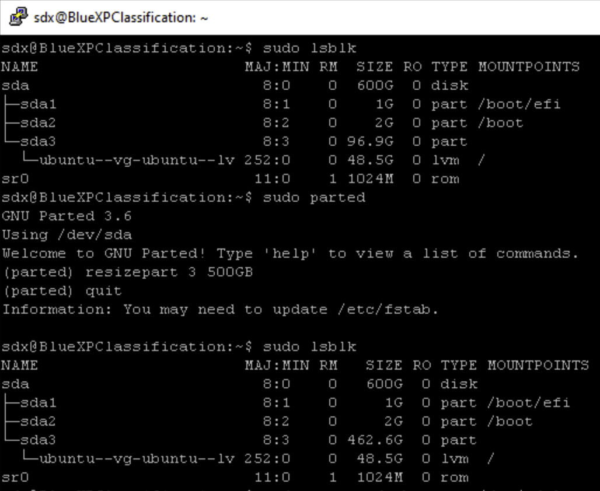
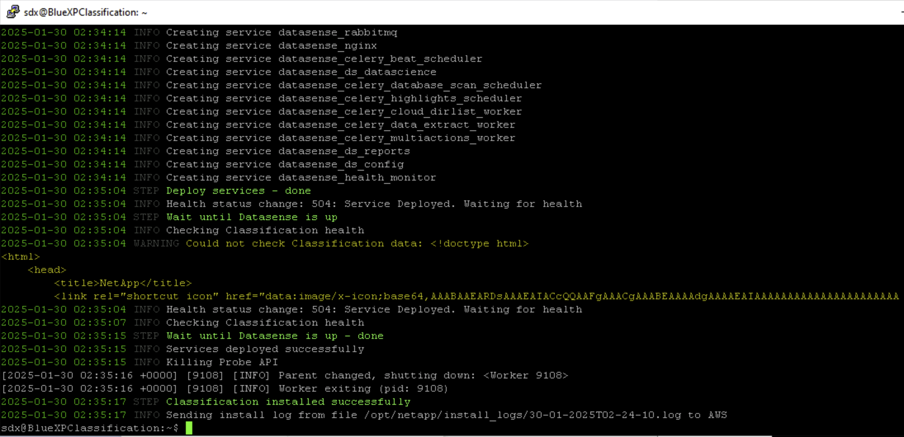

# NetApp BlueXP Connector and Classification

In this lab, you will deploy the NetApp BlueXP Connector and configure classification to manage and organize your data effectively. You'll learn how to integrate BlueXP with your OnTap environment and apply classification policies to enhance data visibility and compliance. This hands-on lab is designed for users with basic NetApp experience, focusing on streamlining data management and security.

In this lab the NetApp datastore is already configured and attached in vCenter.  This lab caters to individuals looking to setup BlueXP account and then installing the connector and classification.

## Lab Activities

* Part 1: Schedule and Access Your Lab
* Part 2: Create NSS (NetApp Support Site) and BlueXP account
* Part 3: Prepare BlueXP Connector VM
* Part 4: Install BlueXP Connector
* Part 5: Set up the BlueXP Connector
* Part 6: Prepare BlueXP Classification VM
* Part 7: Install BlueXP Classification
* Part 8: Set up BlueXP Classification
* Part 9: Create SMB Share and populate for Classification testing
* Part 10: BlueXP Identity & Access Management

## Part 1: Schedule and Access Your Lab

1. Navigate to <https://catalog.siriussdx.com/login.php?sso&redirect=/catalog.php?category_id=19>

2. You will need to login to schedule the lab.  If you don't have an account you can create one by selecting the `Sign up` link at the bottom of the login box.

3. Access the lab by following the instructions that were emailed to you.

## Part 2: Create NSS (NetApp Support Site) and BlueXP account

Ensure the customer has created a NSS (NetApp Support Site) account.  Once they have a NSS account, they will create a BlueXP account and attach the BlueXP account to their NSS account.  When preparing for engagement, send customer email for them to complete this in advance if possible as it can take up to 24 hours for NSS account creations.  You will need a customer-level account for full access to support features within NetApp platforms like BlueXP.

1. From a browser outside of the lab, navigate to https://mysupport.netapp.com/site.
    * Click Create New Account under Get Started on the right side

        * Enter the business email address
        * Verify the captcha
        * Click on NetApp Privacy Policy
        * Access the User Registration tab again
        * Check I have read and accept the NetApp Privacy Policy
        * Click Submit  

2. From a browser outside of the lab, navigate to https://mail.siriussdx.com.
    * Use sdx_bluexp#@cdwsdx.com and PASSWORD (Password provided to you by Tanissa) (Note: Replace # with number provided to you by Tanissa)
    * Retrieve the One Time Passcode (OTP) 
    * Return to the NetApp Sign In tab
        * Confirm email address 
        * Supply the OTP
        * Click Continue  

    * Confirm Customer is selected
    * Populate the Contact Information
        * First Name - Lab-"your initials" 
            * example: LabTF
        * Last Name - SDX
        * Office Phone - 800-000-0000
        * Company Name - SDX Labs
        * Address - 100 Test Ave
        * City - Chicago
        * Postal Code - 60007
        * Country - USA
        * State/Providence - Illinois
    * Click Register
        * Note: Immediate access to NetApp Community, Knowledge Base and training is available; however, it may take up to one business day for full access.  

3. From a browser outside of the lab, navigate to http://bluexp.netapp.com.
    * Click on Get Started in the top right
    * Click Sign up, under the Next button to create a BlueXP account  

    * Be sure to use the same email address you just used to create the NSS account
        * Email - sdx_bluexp#@cdwsdx.com (Note: Replace # with number provided to you by Tanissa)
        * Password - Lab Password found under My Labs
        * Full Name - Lab"your intitials" SDX 
            * example: LabTF SDX
        * Company - SDX Labs
        * Country - United States
    * Click Next  

    * Provide Business address and City, other information is Optional
        * Address - 100 Test Ave
        * City - Chicago
    * Click Sign up  

    * Check I accept the terms and conditions
    * Click Continue  

4. From a browser outside of the lab, navigate to https://mail.siriussdx.com.
    * Use sdx_bluexp#@cdwsdx.com and PASSWORD (Password provided to you by Tanissa) (Note: Replace # with number provided to you by Tanissa)
    * Find the email from service@console.bluexp.netapp.com
    * Click Verify my email  

5. From a browser outside of the lab, navigate to http://bluexp.netapp.com.
    * Click on Get Started in the top right
    * Provide email address sdx_bluexp#@cdwsdx.com (Note: Replace # with number provided to you by Tanissa)
    * Click Next
    * Provide Password - Lab Password found under My Labs
    * Organization Name - SDX Labs
    * Click Associate a NetApp Support Site account  
 
        * Click Continue
        * Provide email address sdx_bluexp#@cdwsdx.com that you created the NSS account for earlier (Note: Replace # with number provided to you by Tanissa)
        * Click Next
            * Retrieve OTP from a browser outside of the lab, navigate to https://mail.siriussdx.com and supply password
        * Supply the OTP
        * Click Continue
        * Click Create
    * Do not be alarmed when you get the following message, because this is a Lab organization within NetApp, you can not associate the BlueXP account with the NSS account at this time.  This exercise was just to get your comfortable with the process.
 

## Part 3: Prepare BlueXP Connector VM

When preparing for engagement, if possible send an email to the customer in advance with the OS and networking requirements to deploy the BlueXP Connector on-prem.   https://docs.netapp.com/us-en/bluexp-setup-admin/task-install-connector-on-prem.html

1. On the lab jumpbox, launch the vCenter shortcut.  

    * Click Don't sign in when prompted to Sign in to Chrome
    * Click Skip to set default browser
    * Click Advanced
    * Choose Proceed to vcenter at the bottom

2. Log into vCenter.
    * Click LAUNCH VSPHERE CLIENT
        * Username - administrator@vsphere.local
        * Password - Lab Password found under My Labs
    * Click the Login button
    * On the left hand side expand vcenter, expand DC and then expand CL
        * Two VM's have already been deployed with the operating system and container requirements for both BlueXP Connector and BlueXP Classification  

    * Click BlueXP Connector VM
        * Note: IP address, 10.242.<3rd octet of Lab Subnet>.70 is needed in next step

3. Click within Type here to Search on the bottom left and type putty.  
    * Click on the PuTTY app  

    * Type the BlueXP Connector VM IP address noted above, 10.242.<3rd octet of Lab Subnet>.70 in Host Name (or IP address)
    * Click Open  

        * Accept the PuTTY Security Alert
    * Login as:
        * Username - sdx
        * Password - Lab Password found under My Labs
            * Note: The sudo password is also the Lab Password found under My Labs

4. Uninstall old versions of Docker.
    * Type the following command: 
        * for pkg in docker.io docker-doc docker-compose docker-compose-v2 podman-docker containerd runc; do sudo apt-get remove $pkg; done
            * sudo password for sdx - Lab Password found under My Labs
    * Note: apt-get might report that you have none of these packages installed, this is okay  

5. Install Docker using the apt repository - there are different installation methods available here: https://docs.docker.com/engine/install/ubuntu/.  For this lab use Install using the apt repository.
    * Copy and Paste the following commands: 
sudo apt-get update
sudo apt-get install ca-certificates curl
sudo install -m 0755 -d /etc/apt/keyrings
sudo curl -fsSL https://download.docker.com/linux/ubuntu/gpg -o /etc/apt/keyrings/docker.asc
sudo chmod a+r /etc/apt/keyrings/docker.asc  

    * Type Y to continue and press enter  

    * Copy and Paste the following commands:
echo \
  "deb [arch=$(dpkg --print-architecture) signed-by=/etc/apt/keyrings/docker.asc] https://download.docker.com/linux/ubuntu \
  $(. /etc/os-release && echo "$VERSION_CODENAME") stable" | \
  sudo tee /etc/apt/sources.list.d/docker.list > /dev/null
sudo apt-get update  

6. Install Specific version of the Docker packages.
    * Copy and Paste the following commands to list the available versions:
        * apt-cache madison docker-ce | awk '{ print $3 }'
    * Note: The latest version and update the version string in the next step.  In this example, the latest version is 5:27.5.1-1~ubuntu.24.04~noble.  

    * Copy and Paste the following commands after updating VERSION_STRING if needed:
        * VERSION_STRING=5:27.5.1-1~ubuntu.24.04~noble
        * sudo apt-get install docker-ce=$VERSION_STRING docker-ce-cli=$VERSION_STRING containerd.io docker-buildx-plugin docker-compose-plugin  

    * Type Y to continue and press enter
    * To confirm Docker is enabled and running Copy and Paste following command:
        * sudo systemctl enable docker && sudo systemctl start docker  

    * Copy and Paste the following commands to remove variables on the host that may be set prior to Connector Install:
        * unset http_proxy
        * unset https_proxy  

## Part 4: Install BlueXP Connector

The installer that is available on the NetApp Support Site may be an earlier version.  After installation, the Connector automatically updates itself if a new version is available.

1. Download the Connector software and copy to the BlueXP Connector VM.
    * From the lab jumpbox, open browser or open New Tab
        * Click Got it if prompted about Enhanced ad privacy in Chrome
    * Access https://mysupport.netapp.com/site/products/all/details/cloud-manager/downloads-tab
    * Click Download Latest Release under Available Software  

        * If redirected to log in, supply the email address and password used to create NSS account in Part 2 or you can use your own NSS account if you have one
    * Check I have read the End User License Agreement
    * Click ACCEPT & CONTINUE  

    * Click DOWNLOAD BLUEXP CONNECTOR ON-PREM  

2. Open WinSCP application on lab jumpbox.
    * Type here to Search on the bottom left and type in winscp
    * Click on the WinSCP app  

    * In Host name
        * Host name - IP address of the BlueXP Connector - 10.242.<3rd octet of Lab Subnet>.70
        * User name - sdx
        * Password - Lab Password found under My Labs
    * Click Login  

    * Click Accept in the Warning

3. Copy the downloaded BlueXP Connector software on the lab jumpbox to the BlueXP Connector VM.
    * Move the BlueXP-Connector-Cloud file from Downloads to Documents in Finder  

    * In WinSCP drag BlueXP-Connector-Cloud in the left panel over to the BlueXP Connector VM /home/sdx directory panel on the right, into the open area
        * Click OK in the Upload prompt  

4. Assign permissions to run the script on the BlueXP Connector VM.
    * From the BlueXP Connector CLI, copy and paste the following command:
        * ls
            * Note: The version is used in the next command
    * Copy and paste the following command where "version" is the version downloaded:
        * sudo chmod +x BlueXP-Connector-Cloud-"version"  

5. Run the installation script.
    * Copy and past the following command where "version" is the version downloaded (Note: Proxy and cacert are optional parameters and not needed in this lab):
        *  sudo ./BlueXP-Connector-Cloud-"version"  

    * This may take a few minutes to complete

## Part 5: Set up the BlueXP Connector

1. On the lab jumpbox, open browser or open New Tab.
    * Access https://"BlueXP Connector IP address"
        * 10.242.<3rd octet of Lab Subnet>.70
    * Click Advanced
    * Click Proceed to IP  

    * Log in to BlueXP
        * Email - sdx_bluexp#@cdwsdx.com (Note: Replace # with number provided to you by Tanissa)
    * Click Next
        * Password - Lab Password found under My Labs
    * Click Log in
    * Provide Connector name of BlueXPConnector"your initials"
        * Connector name example - BlueXPConnectorTF
    * Confirm Organization name is SDX Labs
    * Click Let's Start  

    * Click Let's go to BlueXP  

    * Click Continue on Welcome to NetApp BlueXP prompt  

    * Check Don't show again and click Close in the What's new prompt  
  

2. Add working environment in BlueXP.
    * Click Add working environment 
 
    * Click On-Premises
    * Click Discover in the On-Premises ONTAP Type  

    * Provide Lab ONTAP Cluster information
        * ONTAP Cluster IP - 10.242.<3rd octet of Lab Subnet>.60
        * User Name - admin
        * Password - Lab Password found under My Labs
    * Click Discover  

3. Along the top, you will see the Organization, Project and Connector unique to your lab.
    * Click on On-Premises ONTAP  

    * Click on Enter Working Environment on the right side  

    * Click on System Manager top right if prefer advanced view  

## Part 6: Prepare BlueXP Classification VM

When preparing for engagement, if possible send an email to the customer in advance with the OS and networking requirements to deploy the BlueXP Classificatiom on-prem.   https://docs.netapp.com/us-en/bluexp-classification/concept-cloud-compliance.html#the-bluexp-classification-instance

1. On the lab jumpbox, access vCenter tab or launch the vCenter shortcut.  

    * Click Don't sign in when prompted to Sign in to Chrome
    * Click Skip to set default browser
    * Click Advanced
    * Choose Proceed to vcenter at the bottom

2. Log into vCenter.
    * Click LAUNCH VSPHERE CLIENT
        * Username - administrator@vsphere.local
        * Password - Lab Password found under My Labs
    * Click the Login button
    * On the left hand side expand vcenter, expand DC and then expand CL
        * Two VM's have already been deployed with the operating system and container requirements for both BlueXP Connector and BlueXP Classification  

    * Click BlueXP Classification VM
        * Note: IP address, 10.242.<3rd octet of Lab Subnet>.71 is needed in next step

3. Click within Type here to Search on the bottom left and type putty.  
    * Click on the PuTTY app  

    * Type the BlueXP Classification VM IP address noted above, 10.242.<3rd octet of Lab Subnet>.71 in Host Name (or IP address)
    * Click Open  

        * Accept the PuTTY Security Alert
    * Login as:
        * Username - sdx
        * Password - Lab Password found under My Labs
            * Note: The sudo password is also the Lab Password found under My Labs

4. Uninstall old versions of Docker.
    * Type the following command: 
        * for pkg in docker.io docker-doc docker-compose docker-compose-v2 podman-docker containerd runc; do sudo apt-get remove $pkg; done
            * sudo password for sdx - Lab Password found under My Labs
    * Note: apt-get might report that you have none of these packages installed, this is okay  

5. Install Docker using the apt repository - there are different installation methods available here: https://docs.docker.com/engine/install/ubuntu/.  For this lab use Install using the apt repository.
    * Copy and Paste the following commands: 
sudo apt-get update
sudo apt-get install ca-certificates curl
sudo install -m 0755 -d /etc/apt/keyrings
sudo curl -fsSL https://download.docker.com/linux/ubuntu/gpg -o /etc/apt/keyrings/docker.asc
sudo chmod a+r /etc/apt/keyrings/docker.asc
    * Type Y to continue and press enter  

    * Copy and Paste the following commands:
echo \
  "deb [arch=$(dpkg --print-architecture) signed-by=/etc/apt/keyrings/docker.asc] https://download.docker.com/linux/ubuntu \
  $(. /etc/os-release && echo "$VERSION_CODENAME") stable" | \
  sudo tee /etc/apt/sources.list.d/docker.list > /dev/null
sudo apt-get update  

6. Install Specific version of the Docker packages.
    * Copy and Paste the following commands to list the available versions:
        * apt-cache madison docker-ce | awk '{ print $3 }'
    * Note: The latest version and update the version string in the next step.  In this example, the latest version is 5:27.5.1-1~ubuntu.24.04~noble.  

    * Copy and Paste the following commands after updating VERSION_STRING if needed:
        * VERSION_STRING=5:27.5.1-1~ubuntu.24.04~noble
        * sudo apt-get install docker-ce=$VERSION_STRING docker-ce-cli=$VERSION_STRING containerd.io docker-buildx-plugin docker-compose-plugin  

    * Type Y to continue and press enter
    * To confirm Docker is enabled and running Copy and Paste following command:
        * sudo systemctl enable docker && sudo systemctl start docker  

    * Copy and Paste the following commands to remove variables on the host that may be set prior to Connector Install:
        * unset http_proxy
        * unset https_proxy  

## Part 7: Install BlueXP Classification

The installer that is available on the NetApp Support Site may be an earlier version.  After installation, Classification automatically updates itself if a new version is available.

Note: All installation activities are logged when installing BlueXP classification. If you run into any issues during installation, you can view the contents of the installation audit log. It is written to /opt/netapp/install_logs/.

1. Download the Classification software and copy to the BlueXP Classification VM.
    * From the lab jumpbox, open browser or open New Tab
        * Click Got it if prompted about Enhanced ad privacy in Chrome
    * Access https://mysupport.netapp.com/site/products/all/details/cloud-data-sense/downloads-tab
    * Click Download Latest Release under Available Software  

        * If redirected to log in, supply the email address and password used to create NSS account in Part 2 or you can use your own NSS account if you have one
    * Check I have read the End User License Agreement
    * Click ACCEPT & CONTINUE  

    * Click DOWNLOAD DATASENSE-INSTALLER-"version".tar.gz  

2. Open WinSCP application on lab jumpbox.
    * Type here to Search on the bottom left and type in winscp
    * Click on the WinSCP app  

    * In Host name, supply the IP address of the BlueXP Classification - 10.242.<3rd octet of Lab Subnet>.71
        * Host name - IP address of the BlueXP Classification - 10.242.<3rd octet of Lab Subnet>.71
        * User name - sdx
        * Password - Lab Password found under My Labs
    * Click Login  

    * Click Accept in the Warning

3. Copy the downloaded BlueXP Classification software on the lab jumpbox to the BlueXP Classification VM.
    * Move the DATASENSE-INSTALLER-"version".tar.gz file from Downloads to Documents in Finder  

    * In WinSCP drag DATASENSE-INSTALLER-"version".tar.gz in the left panel over to the BlueXP Classification VM /home/sdx directory panel on the right, into the open area
        * Click OK in the Upload prompt  

4. Unzip the installer file on the BlueXP Classification VM.
    * From the BlueXP Classification CLI, copy and paste the following command:
        * ls
            * Note: The version is used in the next command
    * Copy and paste the following command where "version" is the version downloaded:
        * tar -xzf DATASENSE-INSTALLER-"version".tar.gz  

## Part 8: Set up BlueXP Classification

1. On the lab jumpbox, open browser, open New Tab, or select the BlueXP tab already open.
    * Access https://bluexp.netapp.com
    * Log in to BlueXP
        * Email - sdx_bluexp#@cdwsdx.com (Note: Replace # with number provided to you by Tanissa)
    * Click Next
        * Password - Lab Password found under My Labs
    * Click Log in  

2. Activate Data Sense in BlueXP.
    * Click Governance in the left panel
    * Click Classification
    * Click Deply Classification On-Premises or Cloud  

    * Click Deploy under On Prem in the Install Classification location  

    * Copy the command in Step 2  

3. Due to a limitation in the lab, Step 3 ONLY needs to be completed in the lab.  If the BlueXP Classification instance was deployed per the Classification requirements, this would not have to be done at customer site.
    * Copy and paste the following commands in the CLI of the BlueXP Classification VM
        * sudo lsblk
        * sudo parted
        * resizepart 3 500GB
        * quit
        * sudo lsblk  

        * sudo pvresize /dev/sda3
        * sudo lvextend -l +100%FREE /dev/ubuntu-vg/ubuntu-lv
        * sudo lsblk  

        * sudo df -h
        * sudo resize2fs /dev/mapper/ubuntu--vg-ubuntu--lv  

4. Run installer on BlueXP Classification VM.
    * Paste the command from Step 2 above in the CLI of the BlueXP Classification VM
    * Example of the command: 
        * sudo ./install.sh -a account-kD3yKqHG -c YiVQRi0ztoFTaJ6seJnlyYwKvw1qagoIclients -t eyJhbGciOiJSUzI1NiI...
        * Sudo password for sdx - Lab Password found under My Labs
        * BlueXP Connector IP - 10.242.<3rd octet of Lab Subnet>.70
        * Type n to not use proxy
        * type y to install Classification despite the listed limitations  

            * Note: Depoying Classification may take up to 15 minutes, you can monitor the status from BlueXP too
    * Once install is complete, use BlueXP to continue the configuration in Step 6  
  

5. Monitor Deploying Classification from BlueXP.
    * Access the BlueXP tab in browser  

6. Map & Classify all Volumes in Classification Configuration.
    * Click Map & Classify all Volumes  

    * Click Agree to Map & Classify All Volumes

## Part 9: Create SMB Share and populate for Classification testing

We will create a storage virtual machine/SVM for SMB from BlueXP System Manager.  The SVM is a logical storage container that runs within the cluster.  Each SVM has it's own set of network interfaces, volumes, LUNS and protocols.  By creating logical storage containers you are able to segment protocols, departments and active directory domains.

1. On the lab jumpbox, open browser, open New Tab, or select the BlueXP tab already open.
    * Access https://bluexp.netapp.com
    * Log in to BlueXP
        * Email - sdx_bluexp#@cdwsdx.com (Note: Replace # with number provided to you by Tanissa)
    * Click Next
        * Password - Lab Password found under My Labs
    * Click Log in  

2. Open System Manager for On-Premises ONTAP.
    * Click on On-Premises ONTAP you discovered earlier
    * Click on Enter Working Environment on the right side  

    * Click on System Manager top right  

3. Create SMB SVM.
    * Click Storage from left panel, and then Click Storage VMs
    * From the Storage VMs screen we will Click Add  
    * A new panel will open with the title of Add storage VM.  We will give the Storage VM a name and configure protocols.
        * Storage VM Name - fileserver
        * Access protocol - Enable SMB/CIFS
    * Once you Click Enable SMB/CIFS a sub dialog box will open.  You will need to input your Active Directory information.  This SVM will be joined to the domain with a computer object.
        * Administrator Name - Administrator
        * Password - Use the password listed within the my labs secion.
        * Server Name - fileserver
        * Active Directory Domain - This will be the domain your lab is configured with.  You can get this information by opening a command prompt and typing ipconfig /all.  The DNS Suffix Search List is the Active Directory Domain you will input.  

            * We will leave the Organizational Unit defaulted to CN=Computers
            * Domains - This will be the same Active Directory Domain name you gathered before
            * Name Servers - You can get this IP address from the ipconfig /all output from before.  Copy of the value of DNS Servers.
            * IP address - You will use the first 3 octets of the DNS server.  The last octect will be .62.
            * Subnet Mask - Should auto populate, if not click off the IP address field.
            * Gateway - Should auto populate, if not click off the IP address field.
            * Broadcast Domain and Port - Default  

    * Verify all of the data is correct and Click Save.  If everything was put in correctly the new fileserver will be created and it will take you back to the Storage VMs page.  At this point you've created a new SVM and joined it to the domain. This new SVM has been configured to serve the SMB/CIFS protocol.

4. Create a new volume and network share that users can access and write files to.
    * Within System Manager Click Storage and then Volumes
    * Click the Add button to create a new volume with the following details
        * Name - share
        * Size - 100 GiB
        * Share via SMB/CIFS - Make sure this box is selected
        * Click the Save button  

5. Map a network drive to the share we created and write a file to it.  
        * Click the windows folder icon on the taskbar  
        * Click This PC and then on the top of the windows explorer window click Computer and then map network drive and click map network drive  
        * In the Map Network Drive put in the following values  
            * Drive - Z:  
            * Folder - \\\fileserver\share  
            * Leave Reconnect at sign-in selected  
            * Click Finish  

    * A new windows explorer window will open and you should see the new share we created.
            * Right click anywhere in blank area of the share and create a new text document.  
                * Give the file a name of PII
                * Open PII and paste the following text:  
000-26-6781  
324-00-6781  
324-26-0000  
111-11-1111  
999-99-9999  
123-45-6789  
test@company.com  
11/11/1911  
12/12/1912  
                * Save it  

6. Download PowerShell scripts to create files and simulate Classification FEATURES.  
        * https://github.com/sdxic/netapp_bluexp_classification/blob/master/bluexp-create-files.ps1  
        * Right click the create files PowerShell script  
        * Click run with PowerShell  
            * Type Y for yes if prompted about Execution Policy Change  
        * This will create files in the share you viewed in the previous step.  After the script completes browse the share and verify you can see files.  

## Part 10: Classification Review

1. On the lab jumpbox, open browser, open New Tab, or select the BlueXP tab already open.
    * Access https://bluexp.netapp.com
    * Log in to BlueXP
        * Email - sdx_bluexp#@cdwsdx.com (Note: Replace # with number provided to you by Tanissa)
    * Click Next
        * Password - Lab Password found under My Labs
    * Click Log in  

2. Connect Classification to Active Directory.
    * Click Governance > Classification
    * Check Help make NetApp Classifiction better if prompted
        * Click Accept & Continue  

    * Click Configuration
        * Note: Classification needs access to AD  

    * Click Add Active Directory
        * Username - administrator@"Domain Name will be the domain your lab is configured with"
            * You can get this information by opening a command prompt and typing ipconfig /all.  The DNS Suffix Search List is the Active Directory Domain you will input.
            * example: administrator@lab242-231.lab
        * Password - Lab Password found under My Labs
        * Domain Name - Use your lab domain from Username above
            * lab242-231.lab
        * LDAP Server IP address - 10.242.<3rd octet of Lab Subnet>.100
    * Click Connect  

3. Add CIFS Credentials.
    * Click Add CIFS Creditials  

    * CIFS Creditials
        * Username - administrator@"Domain Name will be the domain your lab is configured with"
            * You can get this information by opening a command prompt and typing ipconfig /all.  The DNS Suffix Search List is the Active Directory Domain you will input.
            * example: administrator@lab242-231.lab
        * Password - Lab Password found under My Labs
    * Click Save  

## Part 10: BlueXP Identity & Access Management

For more information on BlueXP Identity & Access Management, access https://docs.netapp.com/us-en/bluexp-setup-admin/task-managing-netapp-accounts.html#manage-your-account-with-the-tenancy-api.

1. Utilize BlueXP Identity & Access Management to invite other BlueXP user accounts to Organzations and/or Projects.
    * Click on Gear in top right
    * Click Identity & Access Management  
   
    * On What's new, check Don't show again if prompted
        * Click Close
    * Click Members
    * Click Add a member  
      
    * Supply the email address
    * Click the Organization, folder, or project
    * Click the Role
    * Click Add  
   
